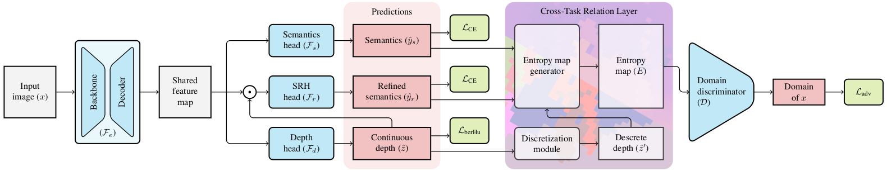

# CTRL-UDA
This is the official PyTorch implementation of our CVPR'21 paper "Learning to Relate Depth and Semantics for Unsupervised Domain Adaptation" [[arXiv]](https://arxiv.org/abs/2105.07830) [[CVF]](https://openaccess.thecvf.com/content/CVPR2021/html/Saha_Learning_To_Relate_Depth_and_Semantics_for_Unsupervised_Domain_Adaptation_CVPR_2021_paper.html)


## Setting up a virtual environment

The following shell commands create a new python virtual environment, install the dependencies, and activate it:

```bash
python -m venv ~/venv_ctrl_uda
source ~/venv_ctrl_uda/bin/activate
pip install -r requirements.txt
```

## Train/Test a CTRL-UDA model
```bash
# STEP-1: First train CTRL-UDA 
main.py --expid=<experiment id> --reso='<"LOW" or "FULL">' --exp_root_dir=<output folder path> --data_root=<dataset root folder path> --pret_model=<pretrained model path>
# STEP-2: Next, train CTRL-UDA  with ISL 
main.py --expid=<experiment id> --reso='<"LOW" or "FULL">' --exp_root_dir=<output folder path> --data_root=<dataset root folder path> --model_path=<trained model path in STEP-1>
```
Where experiment ids are:
| Exp. Id | Description | 
| -------- | -------- | 
|  1   | SYNTHIA to Cityscapes 16 classes |
|  2    | SYNTHIA to Cityscapes 7 classes (full resolution) |
|  3   | SYNTHIA to Cityscapes 7 classes (low resolution) |
|  4    | SYNTHIA to Mapillary 7 classes (full resolution) |
|  5   | SYNTHIA to Mapillary 7 classes (low resolution) |

Download the weights used to initialize the ResNet-101 backbone from [Google Drive](https://drive.google.com/file/d/1qKn_yb_gzgPABCG8AsLdSJYcZUVEGsZr/view?usp=sharing).
and set the path to --pret_model in STEP-1.


## Experiments

### Datasets

* **SYNTHIA**: Please follow the instructions [here](http://synthia-dataset.net/downloads/) to download the images.
  We used the *SYNTHIA-RAND-CITYSCAPES (CVPR16)* split. 
  Download the segmentation labels here [here](https://drive.google.com/file/d/1TA0FR-TRPibhztJI5-OFP4iBNaDDkQFa/view?usp=sharing). 
  Please follow the dataset directory structure:
  ```bash
  <data_root>/Synthia/RAND_CITYSCAPES                           % SYNTHIA dataset root
  ├── RGB
  ├── parsed_LABELS
  └── Depth
  ```

* **Cityscapes**: Please follow the instructions in [Cityscape](https://www.cityscapes-dataset.com/) 
  to download the images and validation ground-truths. 
  Please follow the dataset directory structure:
  ```bash
  <data_root>/Cityscapes                       % Cityscapes dataset root
  ├── leftImg8bit
  │   ├── train
  │   └── val
  └── gtFine
      └── val
  ```

* **Mapillary**: Please follow the instructions in [Mapillary](https://www.mapillary.com/dataset) 
  to download the images and validation ground-truths. 
  Please follow the dataset directory structure:
  ```bash
  <data_root>/Mapillary-Vista                        % Mapillary-Vista dataset root
  ├── train
  │   └── images
  └── validation
      ├── images
      └── labels


### Reported Results

Reported Results on SYNTHIA ⟶ Cityscapes (16 classes) (Exp. Id: 1)
| Method               | mIoU*(13)| mIoU(16) |
| -------------------- | -------- | -------- |
|  SPIGAN-no-PI [34]   | 41.2     |  35.8    |
|  SPIGAN [34]         | 42.4     |  36.8    |
|  AdaptSegnet [55]    | 45.9     |  --      |
|  AdaptPatch [56]     | 46.3     |  --      |
|  CLAN [41]           | 47.8     |  --      |
|  Advent [61]         | 47.6     | 40.8     |
|  DADA [62]           | 49.8     | 42.6     |
|  **Ours (best mIoU)**    | **51.3**     |  **44.9**    |
|  **Ours (confidence)**   | **51.0 ± 0.7** | **44.3 ± 0.6** |

Reported Results on SYNTHIA ⟶ Cityscapes (7 classes full resolution) (Exp. Id: 2)
| Method               | mIoU | 
| -------------------- | -------- |
|  Advent [61]         | 67.2     | 
|  DADA [62]           | 69.2    | 
|  **Ours (best mIoU)**    | **72.3**     |
|  **Ours (confidence)**   | **71.3 ± 0.9** | 

Reported Results on SYNTHIA ⟶ Cityscapes (7 classes low resolution) (Exp. Id: 3)
| Method               | mIoU | 
| -------------------- | -------- |
|  SPIGAN-no-PI [34]   | 46.0     |  
|  SPIGAN [34]         | 53.4    | 
|  Advent [61]         | 59.4    | 
|  DADA [62]           | 63.4    | 
|  **Ours (best mIoU)**    | **65.4**     |
|  **Ours (confidence)**   | **64.9 ± 0.3** | 

Reported Results on SYNTHIA ⟶ Mapillary (7 classes full resolution) (Exp. Id: 4)
| Method               | mIoU | 
| -------------------- | -------- |
|  Advent [61]         | 65.2     | 
|  DADA [62]           | 67.6    | 
|  **Ours (best mIoU)**    | **71.8**     |
|  **Ours (confidence)**   | **70.9 ± 0.7** | 

Reported Results on SYNTHIA ⟶ Mapillary (7 classes low resolution) (Exp. Id: 4)
| Method               | mIoU | 
| -------------------- | -------- |
|  SPIGAN-no-PI [34]   | 26.8     |  
|  SPIGAN [34]         | 44.1    | 
|  Advent [61]         | 54.0    | 
|  DADA [62]           | 55.8    | 
|  **Ours (best mIoU)**    | **61.9**     |
|  **Ours (confidence)**   | **61.3 ± 0.5** | 

### Pre-trained models
Pre-trained models are provided here [Google Drive](https://drive.google.com/drive/folders/1emFWGVCZOA1jH1s8GCbrDGEb_qk5TSj5?usp=sharing).
## Reproducibility 
For ensuring reproducibility, we reported the confidence intervals of the class-specific IOUs and mIoUs on the five different UDA settings (Table 1 and 2 in the main paper). For each setting, we trained our model five times with different random seed values and reported the mean and standard deviation (of the mIoU) over these five runs. Due to the randomness involved in deep generative models, the same seed value might yield slightly different mIoU. In that case, you may need to train a few times or train a bit longer (by changing the EARLY_STOP) to reach a comparable performance.

## Citation
Please cite our work if you find it useful.
```bibtex
@InProceedings{Saha_2021_CVPR,
    author    = {Saha, Suman and Obukhov, Anton and Paudel, Danda Pani and Kanakis, Menelaos and Chen, Yuhua and Georgoulis, Stamatios and Van Gool, Luc},
    title     = {Learning To Relate Depth and Semantics for Unsupervised Domain Adaptation},
    booktitle = {Proceedings of the IEEE/CVF Conference on Computer Vision and Pattern Recognition (CVPR)},
    month     = {June},
    year      = {2021},
    pages     = {8197-8207}
}
```

## Acknowledgement 
+ DADA is used as our baseline and coding reference [official](https://github.com/valeoai/DADA).


